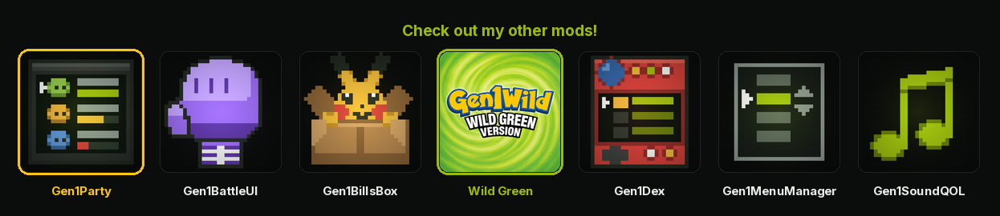

<p align="center">
  <a href="https://wild1walker.github.io/Gen1Wild/"></a>
</p>

<h1 align="center">Gen1Party</h1>

<p align="center">
  <a href="https://wild1walker.github.io/Gen1Wild/"></a>
</p>

The party menu, drawn like the rest of the set.

A mod for [Gen1Recomp](https://github.com/bryanthaboi/gen1recomp).

---

## What it does

### The set's frame

A header box on rows 0–2, the six party members in the 96-pixel body between,
a footer box on rows 15–17 — the same shape Gen1Dex draws, in the same places.
A party opened next to the Pokédex stops looking like a different game.

That body is **exactly** six rows of sixteen pixels, to the last pixel, so no
slot was given up for it. The footer paid instead: three tile rows hold one
line of text, and four of the five prompts the engine hands back are two.
Three rows of header plus five of footer plus twelve of party is twenty
against the eighteen a Game Boy has.

So every prompt prints on one line — and the engine keeps the words wherever
the engine's words fit. `bottomMessage()` is flattened onto one line and
printed verbatim when it is no wider than the box; `Choose a POKéMON.` is
seventeen glyphs against a box that holds eighteen, so the field menu says
exactly what the engine says, and a reword or a translation that *shortens* a
prompt is picked up with nothing in this mod touched. Only a prompt too wide
falls back to this mod's own line:

| Mode | Engine | Here |
| --- | --- | --- |
| Field | `Choose a POKéMON.` | unchanged |
| Swap | `Move POKéMON\nwhere?` | `Move it where?` |
| TM/HM | `Use TM on which\nPOKéMON?` | `Use TM on which?` |
| Item | `Use item on which\nPOKéMON?` | `Use item on which?` |
| Battle | `Bring out which\nPOKéMON?` | `Bring out which?` |

### Every POKéMON in its own colours

Vanilla lays **one** `MEWMON` palette zone over tiles (1,0)–(2,11) — the whole
icon column, all six members at once — so every POKéMON in your party wears the
same salmon.

This replaces that single zone with **one per member**, so each wears its own
species colours: the same thing the Pokédex list does for its rows and
Gen1BillsBox does for its grid. A party opened next to either of them stops
looking like a different game.

The base palette becomes the plain grey ramp too, so the names, numbers and
boxes read as black line art rather than sitting under a bar palette standing
in for a screen palette.

### Nothing runs off the edge

The vanilla row is packed to the last pixel of the screen: the status column
runs 136–160 and the HP numbers 104–160. That is authentic, and it is why an
`FNT` reads as clipped rather than placed.

Both now stop at **152**, the same right margin every other screen in the set
keeps. Measured, not asserted — the suite records what the screen actually
draws and fails if anything reaches past it.

Nothing was given up to pay for it:

- **The status** moves from a fixed `x=136` to right-aligned on 152. Free —
  the level always ends at 128 (`PrintLevel` overwrites the `<LV>` tile with
  the third digit at L100, so two digits and three end in the same place),
  which leaves 128–136 already empty.
- **The HP bar** moves one tile left, from tile 5 to tile 4, and the numbers
  right-align on 152. The bar keeps **all six segments** — it is the
  at-a-glance read on this screen, and shortening it to buy the margin would
  have been the wrong trade. The gap it moves into is the one between the icon
  and the bar, which nothing was using.
- **The numbers** keep their `%3d/%3d` padding rather than becoming variable
  width, because that padding is load-bearing: the bar's right cap sits under
  the first glyph, and a *space* over that cap is what stops the two colliding.

### One footer

Every mode prints into the standard text box — the same `Font.drawBox` chrome
the rest of the set frames with.

This is **not** a difference from current Gen1Recomp. When this screen was
written, three of the seven modes printed a bare line on the bottom row while
the other four used the box, and unifying them was a change. The engine landed
the same unification in [#1610](https://github.com/bryanthaboi/gen1recomp) at
about the same time, so on a current build this mod simply matches it. It is
kept here so the mod behaves the same on either engine.

---

## Options

| Option | Default | What it does |
| --- | --- | --- |
| `SPECIES COLOURS` | ON | Every member in its own species colours over the grey ramp. Off restores the vanilla answer exactly — the `GREENBAR` base and the single `MEWMON` column — for anyone who wants the 1996 screen with nothing changed but the margins. |

---

## Install

Download `Gen1Party-<version>.zip` from
[Releases](https://github.com/wild1walker/Gen1Party/releases) and install it
from the game: **MODS → Import mod .zip**.

---

## Installed, and nothing changed

This mod replaces how the party menu is **drawn** and nothing else, so there
are a few ways for a working install to read as no install at all.

**Check for the boxes, not the icons.** From 1.1.0 the answer is obvious at a
glance: a header box across the top saying `POKéMON` and a boxed footer across
the bottom, with the party in the band between. If the list starts at the very
top of the screen, this mod is not drawing. (On 1.0.x the only tell was the
right margin — an `FNT` ending at 152 with a clear tile of white after it,
rather than running to 160.)

**The icons may already have been colourful.** If you run an icon mod whose
art carries colour a grey ramp cannot, every POKéMON in the party looks
different from its neighbours whether or not this mod is loaded: that art is
re-blit unshaded over the colourised pass, so it sits out this mod's palette
work by design. Per-species colour is only visible on the built-in icons.

**`SPECIES COLOURS` off is supposed to look vanilla.** It restores the
GREENBAR base and the single MEWMON column exactly. The margins still move.

**Otherwise, look at the mod's row in MODS.** From 1.0.2 a mod that cannot
build its screen fails the load and the row says why. Up to 1.0.1 those
failures were logged to a file and swallowed, which left the mod enabled and
drawing nothing of its own — so on 1.0.1 or earlier, a silent row is not
proof that it loaded.

---

## How it works

One registered screen replacement, and it replaces **two methods**: `draw` and
`sgbPalettes`. Everything else is the engine's.

That restraint is the whole design. `PartyMenu` is not one screen but seven
behind a single id — the field menu, the battle switch, the forced switch after
a faint, the item target, the TM/HM teach list with its `ABLE` / `NOT ABLE`
column, the `SOFTBOILED` donor, and the evolution-stone list. Each has its own
input rules, its own bottom message and its own idea of what A does. This mod
has an opinion about how the party *looks* and none at all about what it does,
so the vanilla constructor builds the screen and only the drawing is swapped.

The suite checks that directly: it diffs every field the vanilla constructor
sets against the one this mod hands back, and fails if any of them went missing.

### What the header box cost

Nothing on this screen is free. The set's frame spends 3 tile rows at the top
and 3 at the bottom, and 3 + 3 + 12 is exactly 18 — so all six members fit,
and the bill lands on the footer, which drops from two lines to one.

The alternative was a 5-row footer keeping both lines, which leaves 80 pixels
of body: five visible slots and a scroll, on a screen whose whole job is
showing you the party at once. The words were the cheaper thing to spend.

### There is no ruled icon column either

The Pokédex list rules a hairline between its icons and its names. That rule
needs the names to start at 32; here they start at 24, and the eight pixels can
only come out of the name column — which holds a **nickname**, and a nickname
is the player's own text. Cutting `CHARMANDER` to `CHARMANDE` to make room for
a hairline is not a trade worth making.

### Full-colour icons sit out the palette pass

An icon mod's authored art is re-blit *unshaded* over the colourised pass, so a
species palette under it is paint nobody ever sees — and running it through the
shade remap instead would destroy it, because that remap keys off the **red**
channel and an orange pixel lands on the palette's white. Those icons are
detected per *mon* (not per species, so a shiny tells itself apart), marked
true-colour, and left exactly as their author drew them.

---

## Testing

The suite runs headlessly against a Gen1Recomp checkout, with no ROM.

```sh
# from a Gen1Recomp checkout, with this mod at mods/Gen1Party
luajit mods/Gen1Party/tests/gen1party_test.lua
```

`GEN1PARTY_DIR` overrides where the mod is read from. CI runs the same command
on every push and pull request.

## Releasing

Push to `main` and `.github/workflows/release.yml` packs the mod into an
installable `.zip` and publishes it as a GitHub Release, once per push. The
version is the first rule that applies: a manual **Run workflow** input,
`[release X.Y.Z]` in the commit message, `manifest.json`'s own version when it
is ahead of every tag, otherwise a patch bump. The job refuses to clobber an
existing tag.

## Licence

MIT — see [LICENSE](LICENSE).
